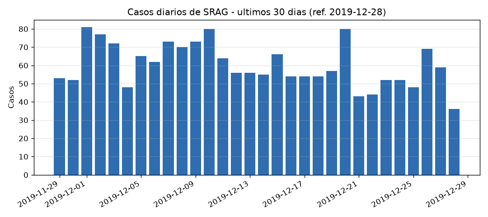
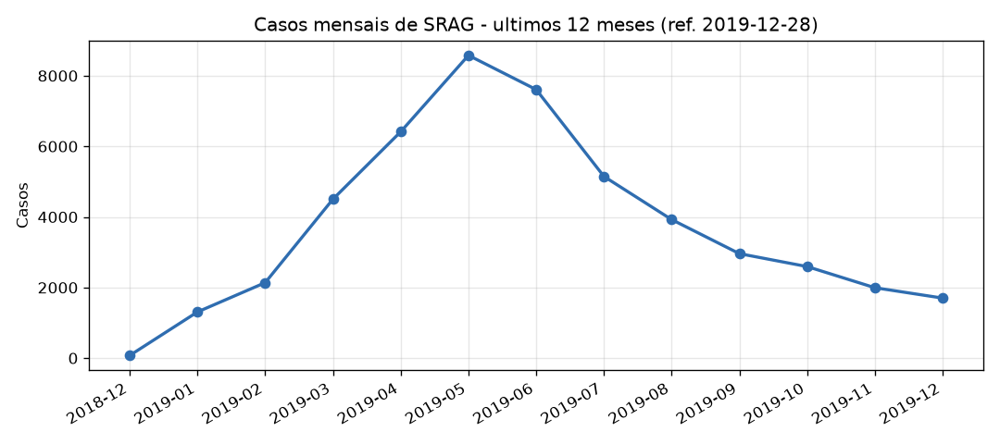

> **Exemplo de saída** gerado por `python -m src.agent.orchestrator`.
> Um relatório novo é produzido a cada execução (as notícias são buscadas em
> tempo real). Este arquivo é apenas uma amostra para consulta rápida.

---

# Relatorio automatizado de SRAG

Gerado em: 2026-07-13 14:23:43

> Aviso: este relatorio e informativo e nao constitui aconselhamento medico, diagnostico, previsao epidemiologica oficial ou recomendacao clinica. Decisoes de saude devem considerar fontes oficiais e profissionais qualificados.

## Resumo executivo

No período de 30 de dezembro de 2018 a 28 de dezembro de 2019, foram registrados 48.941 casos de Síndrome Respiratória Aguda Grave (SRAG). A taxa de mortalidade foi de 12.14%, com 5.423 óbitos entre 44.678 casos com desfecho conhecido. A taxa de ocupação de UTI foi de 36.92%, considerando 17.304 casos hospitalizados que utilizaram UTI. A taxa de vacinação contra gripe entre os casos foi de 32.08%, com 10.011 casos vacinados entre 31.202 com informação conhecida.

## Base de dados

- Banco: `data/srag.db`
- Registros agregaveis: 48941
- Periodo coberto: 2018-12-30 a 2019-12-28
- Granularidade publicada: agregada; o relatorio nao expoe registros individuais.
- Observacao temporal: as metricas sao ancoradas na data maxima disponivel no dataset, nao na data atual.

## Metricas

| Metrica | Valor | Numerador / denominador | Janela | Observacao |
|---|---:|---:|---|---|
| Taxa de aumento de casos | -10.60% | 1805 / 2019 | ultimos 30 dias vs. 30 dias anteriores (ref. 2019-12-28) | Variacao percentual entre os dois periodos. |
| Taxa de mortalidade | 12.14% | 5423 / 44678 | todo o periodo do dataset | Obitos por SRAG / casos com desfecho conhecido (cura ou obito); exclui 'Ignorado'. |
| Taxa de ocupacao de UTI | 36.92% | 17304 / 46864 | todo o periodo do dataset | PROXY: % de casos hospitalizados que usaram UTI entre os hospitalizados com informacao de UTI conhecida. O dataset nao traz leitos totais, entao nao e ocupacao real de leitos. |
| Taxa de vacinacao gripe entre casos | 32.08% | 10011 / 31202 | todo o periodo do dataset | % de casos de SRAG vacinados contra gripe entre os casos com informacao conhecida (1=Sim, 2=Nao). Coluna escolhida por ter a maior cobertura de preenchimento no dataset. NAO representa cobertura vacinal da populacao. |

## Graficos

## Contexto de noticias

Noticias recentes consultadas via `duckduckgo` com query `SRAG Sindrome Respiratoria Aguda Grave Brasil boletim InfoGripe Fiocruz noticias` em `2026-07-13T17:23:36.631929+00:00` UTC. Os trechos abaixo foram sanitizados antes de entrar no relatorio.

| Fonte | Data | Titulo | Trecho sanitizado |
|---|---|---|---|
| [fiocruz.br](https://fiocruz.br/noticia/2026/07/infogripe-numero-de-casos-de-srag-comeca-cair-apos-cinco-meses-de-alta) | n/d | InfoGripe: número de casos de SRAG começa a cair após cinco meses de ... | A mais recente edição do Boletim InfoGripe da Fiocruz , divulgada nesta quinta-feira (9/7), mostra um início de queda do número de casos de Síndrome Respiratória Aguda Grave ( SRAG ) após aproximadamente cinco meses consecutivos de alta no país. Apesar da redução, o estudo alerta que as ocorrências ainda permanecem em níveis elevados em boa parte do território nacional. A análise é ... |
| [fiocruz.br](https://fiocruz.br/noticia/2026/05/infogripe-numero-de-casos-de-srag-continua-aumentando-em-todas-faixas-etarias) | n/d | InfoGripe: número de casos de SRAG continua aumentando em todas as ... | Divulgado nesta quinta-feira (28/5), o novo Boletim InfoGripe da Fiocruz aponta que o número de casos de Síndrome Respiratória Aguda Grave ( SRAG ) continua aumentando - em nível nacional - em todas as faixas etárias. A alta de SRAG está associada ao crescimento do número de hospitalizações por vírus sincicial respiratório (VSR) e influenza A. |
| [atribunamt.com.br](https://www.atribunamt.com.br/esfera-nacional/brasilmundo/2026/07/boletim-infogripe-fiocruz-aponta-queda-da-sindrome-respiratoria-aguda-grave-no-pais/) | n/d | Boletim InfoGripe: Fiocruz aponta queda da Síndrome Respiratória Aguda ... | . Os casos de Síndrome Respiratória Aguda Grave ( SRAG ) seguem em tendência de queda, mas nove capitais ainda registram crescimento da doença, segundo o boletim InfoGripe , da Fundação Oswaldo Cruz ( Fiocruz ), divulgado nesta quinta-feira (9). |
| [oglobo.globo.com](https://oglobo.globo.com/saude/noticia/2026/05/21/gripe-fiocruz-alerta-para-alta-de-sindrome-respiratoria-grave-no-pais-veja-estados-mais-afetados.ghtml) | n/d | Gripe: Fiocruz alerta para alta de síndrome respiratória grave no país ... | O Boletim InfoGripe da Fiocruz alerta para o aumento de casos de Síndrome Respiratória Aguda Grave ( SRAG ) no Brasil , com destaque para 18 estados, incluindo São Paulo e Rio de Janeiro, que ... |
| [folhamg.com.br](https://folhamg.com.br/2026/07/10/infogripe-casos-de-sindrome-respiratoria-aguda-grave-comecam-a-cair-apos-cinco-meses-de-alta-no-brasil/) | n/d | InfoGripe: casos de Síndrome Respiratória Aguda Grave começam a cair ... | Os casos de Síndrome Respiratória Aguda Grave ( SRAG ) apresentam início de queda após quase cinco meses consecutivos de alta no Brasil . É o que aponta a mais recente edição do Boletim InfoGripe , divulgada nesta quinta-feira (9) pela Fundação Oswaldo Cruz ( Fiocruz ). |

## Interpretacao

A taxa de aumento de casos apresentou uma variação negativa de -10.60% nos últimos 30 dias em comparação aos 30 dias anteriores, indicando uma possível redução na incidência de SRAG. É importante ressaltar que a taxa de mortalidade, embora alta, é calculada apenas sobre os casos com desfecho conhecido, o que pode limitar a interpretação. A taxa de ocupação de UTI é uma proxy, pois não reflete a ocupação total de leitos, mas sim a proporção de hospitalizados que necessitaram de UTI. A taxa de vacinação contra gripe, por sua vez, não representa a cobertura vacinal da população, mas sim a proporção de casos de SRAG que estavam vacinados.

Recentemente, o Boletim InfoGripe da Fiocruz indicou uma tendência de queda no número de casos de SRAG após um período de alta, embora ainda haja regiões com aumento de casos. A análise sugere que a situação epidemiológica continua a ser monitorada, especialmente em estados com maior incidência.

## Governanca, guardrails e auditoria

- LangGraph explicita o fluxo: plano, metricas, graficos, noticias, analise (LLM), validacao e escrita.
- Narrativa gerada por LLM: `True` (modelo `gpt-4o-mini`).
- O LLM nao calcula metricas; os numeros saem de SQL/Python deterministico. O LLM apenas interpreta.
- Conteudo externo e tratado como nao confiavel: HTML, caracteres de controle e padroes de prompt-injection sao removidos.
- Se a busca de noticias falhar, o relatorio e gerado com fallback e registra a falha.
- A saida inclui disclaimer medico e limitacoes metodologicas.
- Log estruturado da execucao: `outputs\audit_20260713T172336346354Z.jsonl`
- Validacao automatica: `ok` - sem inconsistencias detectadas

## Limitacoes metodologicas

- Taxa de UTI e proxy de uso de UTI entre hospitalizados, nao ocupacao real de leitos.
- Vacinacao mede registro vacinal entre casos de SRAG com informacao conhecida, nao cobertura vacinal da populacao.
- Noticias ajudam a contextualizar, mas nao alteram os calculos epidemiologicos.
- Dados de SRAG podem ter atraso de notificacao, incompletude e revisoes posteriores.
